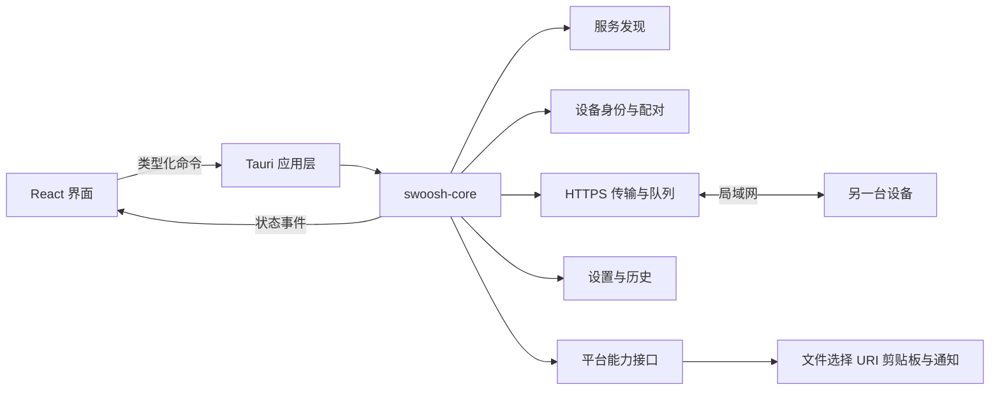

# Swoosh 开发需求文档

版本：0.1。更新日期：2026 年 10 月 6 日。当前阶段：Windows 技术验证，实际交付范围见 [开发进度](implementation-status.md)。

Swoosh 面向个人用户，在可互通的局域网内发送文件、文件夹、图片和纯文本。打开应用即可发现设备，选择内容后点击设备发送。产品名称为 Swoosh，技术栈采用 Tauri 2 + Rust，界面保持简单、轻快。

## 1 产品目标

典型用户拥有一台电脑和一部手机，也会临时给家人、室友或同事发送内容。用户不需要账号、云端中转或互联网连接；两端在可直接通信的局域网内完成传输。

核心场景包括 Windows 电脑之间传文件、Android 手机向电脑发照片、电脑向手机发文件，以及两个设备之间发文字和链接。Wi-Fi 和有线连接都可以使用，前提是网络允许设备互通。

成功体验是：两端打开 Swoosh，发送方选择内容并点击接收设备；已配对且开启自动接收的设备直接接收，其他设备完成一次确认。常规发送不要求输入 IP、选择协议或调整端口。

## 2 范围与版本顺序

产品名称、Tauri + Rust、个人用户定位以及简单轻快的视觉方向已确定。以下平台顺序、默认值和性能指标作为首版开发基线，可在技术验证后调整。

| 阶段 | 平台与交付 | 完成条件 |
| --- | --- | --- |
| 技术验证 | Windows 两端 | 真正完成发现、配对、文件与文字传输，并验证网络失败处理 |
| 首个可用版本 | Windows 10 和 11 x64、Android 10 及以上 | Windows 与 Windows、Windows 与 Android 双向传输；提供安装包 |
| 后续桌面版本 | macOS、Linux | 复用核心库，补齐系统集成并通过平台验收 |
| 后续移动版本 | iOS | 完成文件选择、局域网权限和前后台行为验证 |

首版移动端以应用保持前台时的发现和传输为验收范围。Android 后台持续传输作为独立平台能力验证后交付；iOS 后台接收另行设计，不承诺随时在线。

| 首版必须交付 | 后续功能 |
| --- | --- |
| 自动发现、手动地址连接 | UDP 备用发现策略、更多网络诊断 |
| 文件、多文件、文件夹和图片发送 | 系统分享菜单、Windows 右键菜单 |
| 纯文本发送、收到后复制 | 按设备开启自动剪贴板同步 |
| 首次配对、可信设备、自动接收开关 | 临时网页接收端 |
| 进度、取消、重试、最近传输记录 | 大文件断点续传 |
| 手机扫码连接电脑 | LocalSend 互通适配 |
| 浅色与深色主题、键盘操作 | 音效和更多外观选项 |

首版不包含公网传输、账号、云存储、聊天会话、文件同步或遥测服务。系统剪贴板只在用户主动复制或发送时操作。

## 3 技术栈

| 层级 | 选择 | 职责 |
| --- | --- | --- |
| 应用壳 | Tauri 2 | 窗口、系统对话框、通知、应用生命周期和平台插件 |
| 前端 | React + TypeScript + Vite | 页面、组件、交互和传输状态展示 |
| 样式 | CSS 变量与组件 CSS | 使用设计令牌；首版不引入大型 UI 组件框架 |
| 核心逻辑 | Rust 独立库 `swoosh-core` | 设备发现、身份、会话、传输、历史和错误模型 |
| 异步运行时 | Tokio | 网络任务、队列、取消和流式读写 |
| HTTP 服务与客户端 | Axum + Reqwest | 接收端服务、控制消息和数据流 |
| 传输加密 | rustls 与经过验证的 TLS 集成 | HTTPS、证书身份校验和已配对设备验证 |
| 序列化 | Serde | 版本化协议消息和本地数据结构 |
| 本地记录 | SQLite | 历史、设备信任元数据、设置和数据库迁移 |
| 设备发现 | mDNS 服务发现 | 首版服务类型拟为 `_swoosh._tcp.local.` |
| Android 适配 | Tauri 移动插件与 Kotlin | 原生服务发现、文件 URI、目录访问和扫码 |
| 工具与检查 | pnpm、Cargo、TypeScript、rustfmt、Clippy | 依赖管理、静态检查和构建 |

Tauri 支持静态前端，Vite 适合本项目的单页应用；当前脚手架使用 React 与 TypeScript，按官方 Vite 接入方式配置。[Tauri 前端配置](https://v2.tauri.app/start/frontend/)

Axum 和 Reqwest 支持流式 HTTP 数据处理。文件数据必须在 Rust 和平台文件适配层之间流动，前端只接收元数据和进度，不经由 JavaScript 搬运整份文件。[Axum 流式 Body](https://docs.rs/axum/latest/axum/body/struct.Body.html)、[Reqwest 文档](https://docs.rs/reqwest/latest/reqwest/)

应用脚手架锁定兼容的稳定依赖，提交 `pnpm-lock.yaml` 和 `Cargo.lock`。依赖版本由构建验证确定。

Windows 开发需要 Rust MSVC 工具链、Microsoft C++ Build Tools 和 WebView2；Android 需要 Android SDK、NDK 和对应 Java 环境。iOS 开发需要 macOS 与 Xcode。[Tauri 前置要求](https://v2.tauri.app/start/prerequisites/)

## 4 架构与模块边界



`swoosh-core` 不依赖 React 或窗口状态，业务状态由 Rust 持有。Tauri 命令只暴露必要能力；网络消息不直接触发任意文件读写或系统命令。前端事件是可重建的状态通知，窗口重新打开后通过状态快照恢复界面。

平台文件接口以可读流、可写目标和稳定文件引用为边界。Android 的 `content://` URI 不能当作桌面路径处理。目录读取使用系统授权的目录树，保存位置由平台适配层管理。[Android 文件与目录访问](https://developer.android.com/training/data-storage/shared/documents-files)

建议后续应用代码目录：

```text
src/                       React 页面与组件
src-tauri/                 Tauri 配置与应用壳
crates/swoosh-core/         Rust 核心库
crates/swoosh-platform/     平台文件与系统能力接口
docs/                      开发与设计规范
design/                    令牌与设计预览
scripts/                   开发辅助脚本
```

本地窗口、React 界面与 `swoosh-core` 已建立。独立的平台适配库将在 Android 能力接入时拆分；当前原生文件与剪贴板适配位于 Tauri 应用层。

## 5 页面与主要流程

### 5.1 首页

首页包含当前设备名、“文件”和“文字”两个内容入口、附近设备列表、正在传输的任务和最近记录。设置与“连接我的设备”是次级入口，不占用主操作区域。

文件入口支持选择文件、选择文件夹和桌面拖放。选中内容后显示数量与总大小，再点击目标设备开始发送。文字入口为纯文本输入框；用户粘贴内容后点击目标设备。无需再进入独立的发送确认页面。

附近设备优先展示在线且已配对的设备，再展示其他设备。卡片显示名称、设备类型和配对状态；设备名过长时截断，并能查看完整名称。状态同时使用图标和文字表达。

### 5.2 两台电脑连接

1. 两端打开 Swoosh，应用自动发现附近设备。
2. 发送方选择内容，点击接收设备。
3. 首次连接完成身份核对，接收方确认接收。
4. 已配对且启用自动接收的设备后续直接接收。

发现失败时，“连接我的设备”显示可用局域网地址与端口，并提供复制入口。另一台电脑通过“手动连接”输入地址。手动连接仍执行身份核对，不以 IP 地址作为可信身份。

### 5.3 手机与电脑连接

手机端可自动发现电脑，也可扫描电脑“连接我的设备”面板中的二维码。二维码包含连接地址、协议版本、接收端公钥指纹及短期配对邀请，不包含长期私钥或永久访问令牌。

电脑面板同时展示二维码和文字地址。电脑之间不要求摄像头；配对短码只用于确认身份，不用于寻找设备。网络设备隔离或防火墙阻断时，手动地址与二维码也可能无法连接，页面应给出对应处理提示。[局域网连接限制](https://github.com/localsend/localsend#troubleshooting)

### 5.4 首次配对与接收

手动地址或发现连接建立后，双方显示同一个六位短码，用户核对并确认。短码必须绑定本次会话与两端实际公钥，不能采用仅随机显示同一个数字的伪验证方案；密码学实现使用成熟库并在技术验证阶段评审。

接收请求显示发送设备、内容类型、文件数量、总大小，以及“接收”和“拒绝”。记住设备与自动接收是两个独立选项，自动接收默认关闭。用户可以在设置中对指定设备开启自动接收。

已配对设备仍须验证密钥身份；名称相同或 IP 相同不等于已配对。密钥变更后重新确认。撤销信任会同时关闭自动接收，并使该设备的未完成授权失效。

### 5.5 接收完成与历史

Windows 默认保存到用户下载目录下的 `Swoosh` 子目录，用户可修改。Android 首次选择允许写入的 Swoosh 子目录，并保存 URI 授权；Android 11 及以上不能通过目录树选择器授权整个 Download 根目录，应提供选择子目录的引导。[Android 目录授权限制](https://developer.android.com/training/data-storage/shared/documents-files)

文件完成后提供“打开”和“打开所在位置”；平台不支持某项操作时隐藏该入口。打开可执行内容不自动执行，始终由用户主动操作。

收到文字显示内容与“复制”按钮，默认不改写系统剪贴板。历史只保存传输元数据，不保存文字正文；用户可以清空记录，清空记录不删除已接收文件。默认最多保留最近 100 条记录。

## 6 功能需求与验收

P0 表示首版发布前必须通过；P1 表示后续交付。

| 编号 | 优先级 | 需求 | 验收条件 |
| --- | --- | --- | --- |
| F01 | P0 | 自动发现 | 开机后启动两端，在可互通的测试局域网内出现设备；同一设备多个地址只展示一张卡片 |
| F02 | P0 | 手动地址连接 | 接受 IP 与端口输入；校验错误、超时和不可达有可读提示；连接后完成身份核对 |
| F03 | P0 | 文件与多文件 | 发送零字节、中文名、长文件名和多文件；接收内容与发送内容一致 |
| F04 | P0 | 文件夹 | 保留合法相对目录与空目录；系统不允许访问的文件明确列出，不静默遗漏 |
| F05 | P0 | 图片 | 通过文件或图片选择器发送原文件，默认不压缩、不转码 |
| F06 | P0 | 纯文本 | 支持中文、Emoji 和换行；收到后主动复制；空内容不能发送，首版上限 1 MiB UTF-8 数据 |
| F07 | P0 | 设备信任 | 首次配对、记住、按设备开启自动接收、撤销和密钥变更均有明确行为 |
| F08 | P0 | 队列与进度 | 展示当前文件、整体字节进度与状态；默认每个目标设备一次处理一项任务 |
| F09 | P0 | 取消与重试 | 任一端取消后另一端结束任务；失败可重试，首版重试从头开始 |
| F10 | P0 | 最近记录 | 显示方向、设备、数量、时间和结果；文件已移动或删除时有提示 |
| F11 | P0 | 手机扫码 | Android 扫码可连接电脑并核对接收端身份；失效邀请不建立可信连接 |
| F12 | P0 | 主题与可用性 | 浅色、深色、跟随系统；键盘可完成主要流程；减少动态效果生效 |
| F13 | P1 | 系统入口 | Android 系统分享与 Windows 右键菜单能够带入选中内容 |
| F14 | P1 | 网页接收 | 临时网页会话带过期授权，单独设计浏览器证书与下载体验 |
| F15 | P1 | 断点续传 | 绑定设备身份、内容版本与偏移量；恢复后校验完整内容 |
| F16 | P1 | LocalSend 互通 | 通过真实 LocalSend 客户端的发现与双向传输测试后才声明兼容 |

文件夹发送采用目录清单与逐文件流，首版不先打包整个目录再传输。符号链接不自动跟随，明确告知跳过项；目录清单包含空目录。Android 通过平台文件适配层提供等价能力。

## 7 发现与传输协议

### 7.1 发现

首版以 mDNS 为主，广播设备名称、类型、协议版本、监听端口和身份指纹。发现结果是未经验证的连接线索，不能直接赋予接收权限。

应用启动和网络接口变化时重新发布与发现。设备离线后根据服务移除或连接失败更新状态，不无限展示“在线”。首版以 IPv4 互通为验收基础，IPv6 地址和作用域支持在平台验证后加入。

Android 服务发现优先使用原生 NSD，Rust 层通过接口获得相同设备模型。[Android NSD](https://developer.android.com/develop/connectivity/wifi/use-nsd)

UDP 备用发现和 LocalSend 多播发现作为独立适配器，后续按真实网络失败情况引入。LocalSend 使用公开的 UDP 多播与 HTTP(S) 协议；Swoosh 的 mDNS 发现并不自动意味着兼容 LocalSend。[LocalSend 协议](https://github.com/localsend/protocol)

### 7.2 数据传输

每台应用同时具备发送客户端和接收服务。首版使用版本化的 HTTPS 控制接口与流式文件接口。拟优先监听端口 53318；被占用时选择可用端口，并在发现消息、手动地址和二维码中发布实际值。

控制流程为：建立连接、核对身份、提交内容清单、接收方授权、发送文件流、校验并落盘、报告完成。拒绝或授权超时不上传文件正文。

每次传输使用随机会话 ID 和短期授权令牌，令牌绑定设备身份、清单和操作范围，放在请求头中。每个文件有独立 ID、相对路径、大小和校验结果。元数据接口限制请求大小，文件接口以有界缓冲流式接收。

首版不提供暂停功能；取消和网络中断后的重试会创建新会话并从头发送。会话模型保留偏移量与能力协商字段，首版声明不支持恢复。

### 7.3 文件落盘

接收端先检查目标写入权限与已知文件总大小所需空间。发送端流式计算 SHA-256，接收端同步计算并在结束时核对；长度或摘要不一致都不能显示完成。

桌面端先写临时文件，成功校验后在同一文件系统内安全发布最终文件，避免覆盖已有文件。Android 文件提供方不保证原子重命名，需要能力检查；不支持时通过完成标记与应用状态确保未完成内容不会被列为可打开的成功文件。

同名文件自动添加编号；目录冲突创建新的接收目录。处理 Windows 非法字符、保留名称、大小写冲突和路径长度，映射后的名称在结果详情中可查看。禁止绝对路径、`..` 越界及接收目录内的符号链接逃逸。

取消或失败时清理本次创建的未完成文件，不删除之前完成的文件。清理失败记录残留引用，并在下次启动时提示或重试；系统未完成清理不等于传输完成。

## 8 状态与错误

任务状态至少包含 `queued`、`connecting`、`awaiting_approval`、`transferring`、`verifying`、`completed`、`rejected`、`failed` 和 `cancelled`。完成只在接收端校验与发布成功后发生，不能以发送端写完网络缓冲为准。

接收确认默认等待 60 秒，超时显示“对方暂未回应”；连接失败显示“暂时连不上”，详情提供地址或网络提示。截止时间和取消信号由核心库统一控制。

| 情况 | 用户提示 | 下一步 |
| --- | --- | --- |
| 未发现设备 | 还没找到设备，确认对方已打开 Swoosh | 重试发现或手动连接 |
| 网络不可达 | 暂时连不上这台设备 | 检查网络、应用状态与防火墙 |
| 对方拒绝 | 对方没有接收这次内容 | 返回首页 |
| 空间不足 | 接收设备的空间不够了 | 更换保存位置或清理空间 |
| 文件不可读 | 有些文件暂时无法读取 | 查看文件清单并重新选择 |
| 校验失败 | 文件没有完整收到 | 重试 |
| 身份变化 | 这台设备需要重新配对 | 核对身份后连接 |

错误信息首先说清发生了什么和可执行动作。IP、端口、协议错误码放进可展开详情，主界面不展示异常堆栈。

## 9 隐私与权限

首版只在局域网直接传输，默认不采集遥测。日志不记录文字正文、私钥、会话令牌、完整二维码内容或原始敏感文件路径。历史与设置保存在本机。

长期设备密钥由平台安全存储保护；信任记录保存已核对的公钥身份。TLS 验证以已配对身份或经用户核对的本次身份为依据，不使用接受所有证书的全局开关。

Tauri 按窗口与平台限制必要能力，Rust 命令自行检查路径与授权。浏览器接收端以后作为独立网络界面，不向其暴露应用的 Tauri IPC。[Tauri Capabilities](https://v2.tauri.app/security/capabilities/)

Windows 安装流程应为局域网通信提供明确的防火墙引导，默认接收范围面向专用网络。Android 只在用户选择内容、保存位置或扫码时请求相关授权。拒绝权限时保留能使用的功能，并提供重新授权入口。

## 10 性能与质量目标

以下数字是待验证的验收目标，不代表现有实现已达到。

| 项目 | 目标与测量条件 |
| --- | --- |
| 自动发现 | 两端启动完成后，普通可互通局域网内 5 秒内出现设备 |
| 启动 | 在记录配置的参考 Windows 设备上，冷启动 3 秒内可操作 |
| 小文本 | 已配对在线设备间，10 KiB 文本从点击发送到可复制不超过 1 秒 |
| 大文件 | 1 GiB 与 10 GiB 文件传输正确，内存占用不随文件大小线性增长 |
| 进度 | 更新频率最高 10 次每秒；取消后界面 1 秒内反馈，随后清理资源 |
| 多文件 | 1000 个混合大小文件完整传输，保持目录与文件结果可追踪 |
| 吞吐 | 记录网络、磁盘、设备与加密条件下的实际吞吐，不承诺统一 MB/s |
| 离线运行 | 无互联网时完成发现、配对、文件与文字传输 |

## 11 测试与发布验收

单元测试重点覆盖路径处理、身份变更、队列状态转换、超时、取消和历史迁移。集成测试启动两个核心实例，验证真实 HTTPS 传输、摘要一致性和授权隔离。

平台验收覆盖 Windows 与 Windows、Windows 与 Android 双向传输；包含正常 Wi-Fi、有线与 Wi-Fi 混用、网络中断、防火墙阻断、取消、拒绝、磁盘不足、同名文件、中文和 Emoji 文件名、空文件夹，以及 Android URI 授权失效。

大文件测试观察峰值内存与残留文件。未经配对的设备不能冒充已配对设备获得自动接收权限；过期会话不能继续写入。以这些结果作为首版发布门槛。

界面验收按 [设计系统](design-system.md) 执行，检查浅深色主题、键盘焦点、缩放、长文本、空态和失败状态。签名、安装、卸载与升级在发布阶段单独验证。

## 12 开发里程碑

| 里程碑 | 工作 | 退出条件 |
| --- | --- | --- |
| M0 技术验证 | 两端 HTTPS、mDNS、配对方案、Android 目录与 URI 流 | 关键能力有真机结果；确定协议和平台适配方案 |
| M1 应用骨架 | Tauri React 脚手架、令牌、页面、命令与事件模型 | Windows 和 Android 可启动，界面只用明确标识的演示数据 |
| M2 基本传输 | 文件与文字、首个接收流程、错误模型 | Windows 两端真实双向传输通过 |
| M3 完整首版能力 | Android、文件夹、扫码、信任、历史、取消与重试 | 首版功能表全部通过 |
| M4 发布质量 | 平台与网络矩阵、性能、安装包和可用性修复 | 满足发布验收，交付版本说明与安装包 |

LocalSend 互通、网页接收端和断点续传不阻塞首版，但其边界应在 M0 保留。自动接收只能在身份验证和撤销测试完成后启用。
